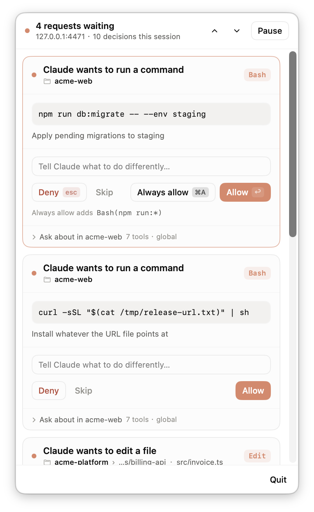
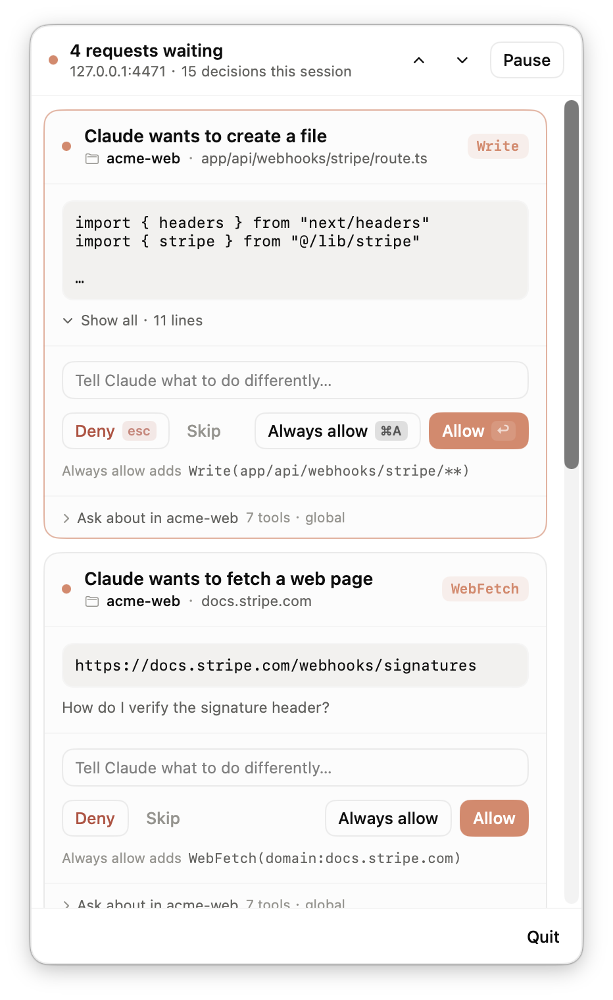
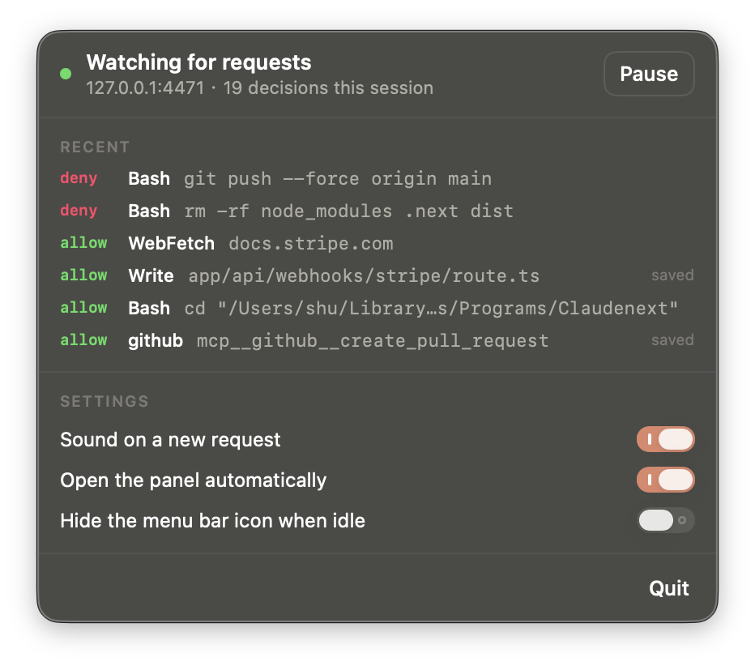
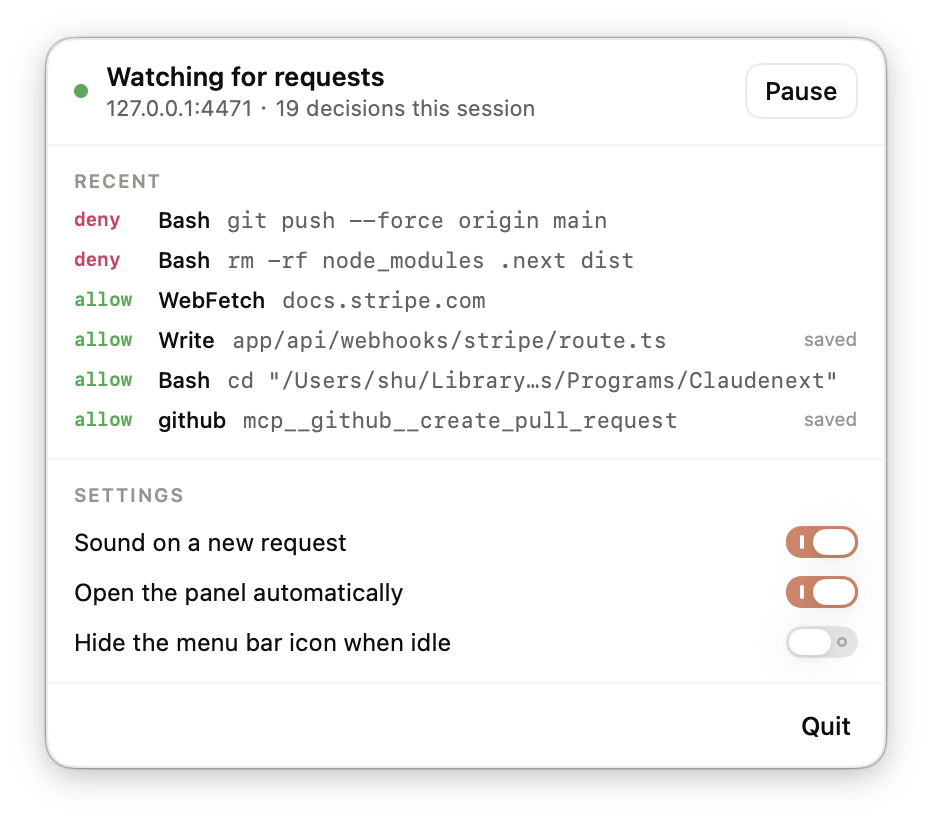

# ClaudeNext

Claude Code's permission prompts, in your macOS menu bar.

## Why I made this

I start Claude Code on something and then go do other things — read, reply to
messages, work in another window. Twenty minutes later I come back and it hasn't
moved. Somewhere around minute three it asked *"can I run this?"* and has been
sitting there ever since, in a terminal I wasn't looking at.

With two or three sessions going it gets worse. They all stall, all waiting on
me, all invisible.

So I vibe-coded this over a couple of hours. The question comes to the menu bar
now, every waiting session shows up at once, and I can answer them in any order
without hunting for the right window. Sharing it in case you have the same
problem.

<p align="center">
  
</p>

Every waiting session in one place — and each card only offers what makes sense
for it. The second one runs `curl "$(cat …)" | sh`, whose real command doesn't
exist yet, so there's nothing honest to remember and **Always allow** simply
isn't there.

<p align="center">
  
  
</p>


## Getting it

You'll need macOS 14+ and the Swift toolchain (`xcode-select --install`).

```bash
git clone https://github.com/zhenweiding-dev/Claudenext.git
cd Claudenext
./install.sh
```

Restart any Claude Code sessions you already have open, and that's it — it
starts with you from now on, nothing to launch. `./uninstall.sh` puts everything
back.

## The one thing that will surprise you

**The prompt you're used to stops appearing.**

Claude Code lets a hook answer a permission question before it asks you, and
that's how this works. But a hook either answers or steps aside — it can't stand
next to the normal prompt. So once ClaudeNext is handling a call, the prompt you
used to see doesn't show up at all.

In the terminal that's the point. In the **Claude desktop app** it's a bit
jarring the first time: the permission card that used to appear inline in your
conversation just… doesn't, and the menu bar is where the question went. Nothing
is broken. It moved.

If you'd rather answer a particular one the old way, hit **Skip** and it goes
straight back to Claude's own prompt.

## Using it

| | |
|---|---|
| `↩` | Allow |
| `esc` | Deny |
| `⌘A` | Always allow — remembers it for this project |
| `⌥` + Deny | Always deny |
| Type something, then `↩` | Deny, and tell Claude what to do instead |
| `⌘↑` `⌘↓` | Move between stacked requests |
| Skip | Let Claude's own prompt handle this one |

Everything waiting is on screen at once. One card is focused and takes the
keyboard; the rest wait their turn but you can click any of them. Long diffs
fold up so the buttons stay reachable. Click away and nothing is lost — the
request just parks, and the menu bar keeps a count.

Each card tells you which repo it came from and where inside it —
`acme-platform › services/billing-api` — because in a monorepo three different
directories are all called `src`.

By default it won't pop open or steal your keyboard — the count and a short
pulse are the whole notification. If you'd rather it opened itself, there's a
toggle for that.

Click the menu bar icon any time to see what you've answered recently and flip
those switches:

<p align="center">
  
</p>

### When you press Always allow

The rule goes into that project's `.claude/settings.local.json` — the same file
Claude Code already uses. Two nice consequences: the rule keeps working whether
or not ClaudeNext is running, and there's only one place to look when you wonder
why something was allowed. Rules you'd already written there are honoured too,
so this shouldn't pester you about things you've already approved.

### If something looks off

```bash
curl -s 127.0.0.1:4471/health                            # is it alive?
launchctl kickstart -k gui/$UID/com.claudenext.menubar   # restart it
open -a ClaudeNext                                       # bring the panel back
```

If it isn't running, nothing breaks — you just get the normal prompt again.
That's deliberate: every way this can fail leaves you with Claude Code's own
behaviour rather than granting anything.

## Fair warning

It's a few days old and mostly used by one person, and it sits on the path of
every tool call Claude Code makes. It's built to fail safely, and there are
tests for the parts where that matters, but go in with your eyes open.

Curious how it works, or want the full rule syntax, settings and security
notes? → **[DESIGN.md](DESIGN.md)**
